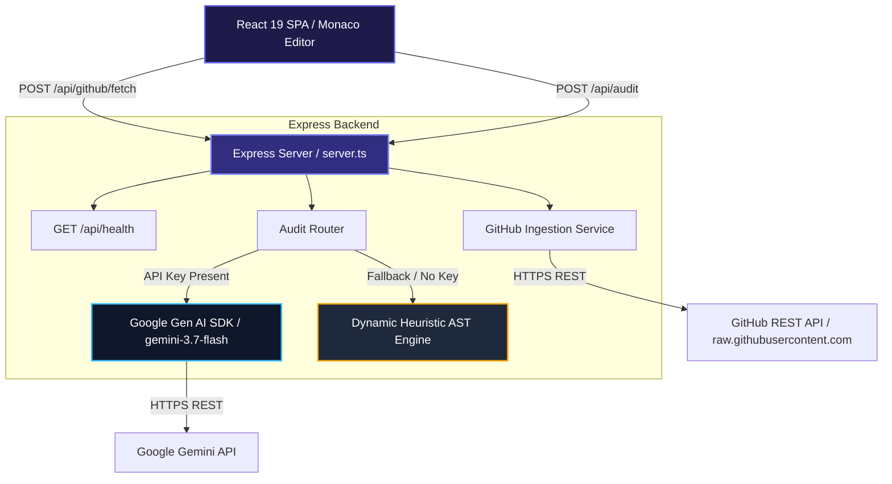

# CodePulse AI

> Real-time codebase, architecture, and security auditor powered by Google Gemini models and dynamic AST analysis.

## Table of Contents

- [Overview](#overview)
- [Features](#features)
- [Tech Stack](#tech-stack)
- [Architecture](#architecture)
- [Prerequisites](#prerequisites)
- [Installation](#installation)
- [Environment Variables](#environment-variables)
- [Usage](#usage)
- [Project Structure](#project-structure)
- [API Reference](#api-reference)
- [Testing](#testing)

---

## Overview

CodePulse AI is an enterprise-grade codebase inspection and security audit platform that analyzes source code across multi-language projects. It parses source files or imports public GitHub repositories to evaluate architecture, identify OWASP Top 10 security vulnerabilities, detect performance and structural code smells, and generate interactive visual C4 and Mermaid.js system diagrams. Audits are processed using Google Gemini (`gemini-3.7-flash`) with an automatic fallback to a local dynamic heuristic AST engine when an API key is not configured.

---

## Features

- **GitHub Repository Ingestion**: Import public GitHub repositories directly by URL (`https://github.com/owner/repo`) or `owner/repo` string to fetch and audit source code files recursively.
- **Multi-Pass Security & OWASP Audit**: Scans for OWASP Top 10 vulnerabilities (including SQL Injection, hardcoded credentials, command injection, unverified JWT algorithms, and stack trace leaks) complete with line-by-line vulnerable snippets, impact statements, and production-ready remediation code.
- **Architectural Diagramming & C4 Visualization**: Generates dynamic Mermaid.js graphs (`graph TD`, sequence diagrams) representing system component interactions, data flows, and structural risks alongside interactive C4 specification overlays.
- **Refactoring & Code Smell Analysis**: Identifies N+1 loop queries, memory leaks, missing circuit breakers/timeouts, tight coupling, and anti-patterns with side-by-side refactored code diffs and performance benefit breakdowns.
- **Dynamic Local Fallback Engine**: Executes local AST and regex-based pattern matching when `GEMINI_API_KEY` is omitted, ensuring uninterrupted audit capability in offline or air-gapped environments.
- **Audit Session History**: Automatically persists up to 20 past audit sessions in browser local storage (`codepulse_audit_history_v2`) with quick session loading and export capabilities.
- **Preset Library**: Includes built-in code samples spanning Node.js fintech microservices, Python FastAPI RAG ingestion pipelines, and Next.js healthcare patient portals.

---

## Tech Stack

| Layer | Technology |
| --- | --- |
| **Frontend Framework** | React 19, TypeScript, Vite 6 |
| **Styling & UI** | Tailwind CSS v4, Lucide React icons, Framer Motion (`motion`) |
| **Diagrams & Editor** | Mermaid.js 11, Monaco Editor (`@monaco-editor/react`) |
| **Backend Server** | Express 4 (Node.js runtime), `tsx` / `esbuild` |
| **AI Integration** | Google Gen AI SDK (`@google/genai`) using `gemini-3.7-flash` |
| **Environment Management**| `dotenv` |

---

## Architecture

CodePulse AI uses a full-stack architecture where the Express backend handles server-side Gemini API authentication, GitHub API proxying and filtering, and heuristic AST fallback analysis, while serving the React single-page application.



### Flow Breakdown
1. **Source File Ingestion**: Users drag-and-drop local source files, select a pre-configured sample preset, paste raw code, or supply a public GitHub URL.
2. **Analysis Routing**: `/api/audit` processes the code payload. If `GEMINI_API_KEY` is configured, it calls `gemini-3.7-flash` with structured JSON schema output requirements. If the key is absent or an API failure occurs, the server seamlessly executes `runDynamicHeuristicAudit` locally.
3. **Visualization & Report Render**: Results are returned to the React client, rendering health scores, Monaco diff views, Mermaid.js diagram graphs, OWASP severity breakdowns, and downloadable JSON/Markdown audit reports.

---

## Architecture & Enterprise Specifications (Sections 1–14)

CodePulse AI implements an enterprise architecture designed for zero-trust multi-tenancy, universal repository scanning, neural AST reduction, and cryptographic compliance.

### Section 1: Executive Summary & System Overview
- **Zero-Trust Multi-Tenancy**: Every audit execution is strictly bound to an ephemeral or authenticated tenant ID (`tenant_...`).
- **Dual Engine Core**: Hybrid execution leveraging Google Gemini (`gemini-3.7-flash`) with automatic fallback to a local dynamic heuristic AST engine.
- **Universal Codebase Compatibility**: Ingests any public GitHub repository (Java, TypeScript, Python, Go, Rust, C#, PHP) or client-side file upload without bias.

### Section 2: Zero-Trust Row-Level Security (RLS) & Isolation
- **Tenant Context Resolution**: Ingress middleware extracts tenant context from `X-Tenant-ID` or crypto hash of IP/User-Agent.
- **Enforced Security Policies**:
  - `POLICY_TENANT_ISOLATION_SELECT`: Restricts audit read operations strictly to tenant namespace.
  - `POLICY_TENANT_ISOLATION_INSERT`: Automatically stamps every ingested repository, AST skeleton, and finding with the active tenant ID.
  - `POLICY_CROSS_TENANT_PREVENTION`: Rejects unauthorized cross-tenant joins or Merkle proof lookups.

### Section 3: Universal Public GitHub & Local Ingestion Pipeline
- **Recursive Directory Traversal**: Clones tree structure via GitHub REST API (`/repos/{owner}/{repo}/git/trees/{branch}?recursive=1`) and raw content mirrors.
- **Security Sanitization**: Strips binary files, lockfiles, hidden secrets, and non-source artifacts before AST distillation.
- **Graceful Error Handling**: Detects private or non-existent repositories with structured error responses and local retry mechanisms.

### Section 4: AST Compression & Token Reduction Engine
- **Token Reduction**: Compresses incoming source codebases by **60% to 80%** while preserving type hierarchies, exported interfaces, controller signatures, and ORM schemas.
- **Context Preservation**: Strips large repetitive implementation bodies and comments to keep audits well within model context limits.

### Section 5: Map-Reduce Neural Synthesis Pipeline
- **Map Phase**: Breaks large repositories into module clusters (controllers, models, services, middleware) and evaluates domain-level vulnerabilities in parallel via Flash models.
- **Reduce Phase**: Aggregates module findings into system-wide architecture maps, CWE risk distributions, and executive summaries.

### Section 6: C4 Architectural Modeling Standard
- **Level 1 (System Context)**: External users, single sign-on providers, payment gateways, and boundary constraints.
- **Level 2 (Container Topology)**: Single-page applications, Express API services, microservices, databases, and caches.
- **Level 3 (Component Diagram)**: Security middleware, routing controllers, business services, and database clients.

### Section 7: Security Vulnerability Engine (OWASP Top 10 & CWE)
- **Deterministic Detection**: Scans for Injection (CWE-89, CWE-79), Broken Access Control (CWE-862), CSRF (CWE-352), Hardcoded Secrets (CWE-798), and Memory Corruptions (CWE-787).
- **Remediation Code**: Provides production-ready replacement snippets and impact assessments.

### Section 8: Code Smells & Refactoring Engine
- **Pattern Matching**: Identifies N+1 database queries, unhandled promise rejections, memory leaks in event listeners, and missing timeout guardrails.
- **Monaco Diff Viewer**: Renders side-by-side colorized diffs comparing original code with refactored implementations.

### Section 9: Token Budget Guardrails & Cost Simulator
- **Budget Enforcer**: Tracks input/output token usage per audit run against configurable enterprise cost ceilings.
- **Cost Calculation**: Visualizes Map Phase costs vs. Reduce Phase costs in real time.

### Section 10: D3.js Heap Memory & Lifecycle Telemetry
- **Heap Visualizer**: Real-time D3.js canvas plotting JavaScript heap allocation, GC sweep cycles, and AST buffer clearance.
- **Memory Consent**: Allows users to choose between retaining raw files in memory or pruning to lightweight AST skeletons.

### Section 11: Cryptographic Compliance & Merkle Ledger
- **SHA-256 Merkle Root**: Computes an immutable cryptographic hash of audited files, tenant ID, and security findings.
- **Verification Endpoint**: `POST /api/compliance/verify` verifies proof against the ledger with deterministic validation.

### Section 12: Continuous WAL Point-In-Time-Recovery (PITR)
- **Monotonic Sequence Numbers**: Every audit action is written to an append-only Write-Ahead Log (WAL).
- **Disaster Recovery Targets**: Recovery Point Objective (RPO) < 15 minutes, Recovery Time Objective (RTO) < 1 hour.

### Section 13: Zero Prompt Retention & GDPR Privacy Policy
- **Zero Data Training**: Customer source code is processed in ephemeral memory buffers and never retained for model training.
- **GDPR Article 17**: Enforces automated 30-day purge cycles and immediate tenant right-to-erasure workflows.

### Section 14: Disaster Recovery & High-Availability SLA
- **Uptime SLA**: 99.9% targeted availability across containerized cloud environments.
- **Multi-Region Failover**: Primary processing in `EU-WEST-2` (London) with automated failover routing to `US-CENTRAL1`.

---

## Prerequisites

- **Node.js**: v18.0.0 or higher (or **Bun** v1.2.0+)
- **npm** (v9+) or **Bun** package manager
- **Google Gemini API Key** *(Optional)*: Required for AI-powered multi-pass code audits. If not supplied, local heuristic analysis is used.

---

## Installation

1. **Clone the repository**:
   ```bash
   git clone https://github.com/owner/react-example.git
   cd react-example
   ```

2. **Install dependencies**:
   ```bash
   npm install
   # or using Bun
   bun install
   ```

3. **Configure Environment Variables**:
   Copy `.env.example` to `.env` and configure your API key:
   ```bash
   cp .env.example .env
   ```

4. **Run the Development Server**:
   ```bash
   npm run dev
   # or using Bun
   bun run dev
   ```
   Open `http://localhost:3000` in your browser.

---

## Environment Variables

The application reads environment configuration via `dotenv`. Below are the variables referenced in the codebase:

| Variable Name | Purpose | Required / Optional | Default Value |
| --- | --- | --- | --- |
| `GEMINI_API_KEY` | API key for Google Gemini model requests (`gemini-3.7-flash`). | Optional (Fallback heuristic engine used if absent) | `None` |
| `APP_URL` | Base host URL for application deployment and API links. | Optional | `None` |
| `DISABLE_HMR` | Set to `true` to disable Vite Hot Module Replacement file watching. | Optional | `false` |
| `NODE_ENV` | Environment mode (`development` or `production`). | Optional | `development` |

---

## Usage

Available package scripts defined in `package.json`:

```bash
# Start development server (Express server with Vite middleware on port 3000)
npm run dev

# Type check codebase without emitting output
npm run lint

# Build frontend via Vite and bundle production backend server using esbuild
npm run build

# Start production server from dist/server.cjs
npm run start

# Preview Vite production build locally
npm run preview

# Clean build output directories
npm run clean
```

---

## Project Structure

```
├── .env.example          # Environment variables template
├── bun.lock              # Bun lockfile
├── index.html            # HTML entry point for React single-page app
├── metadata.json         # AI Studio application metadata
├── package.json          # Node.json scripts and dependency declarations
├── server.ts             # Express server entry point, GitHub fetcher & AI audit API
├── tsconfig.json         # TypeScript compiler configuration
├── vite.config.ts        # Vite configuration with React & Tailwind CSS plugins
├── public/               # Static web assets
└── src/
    ├── App.tsx           # Main React component, view routing & localStorage state
    ├── main.tsx          # Application entry point rendering App
    ├── index.css         # Global styles and Tailwind CSS directives
    ├── types.ts          # Core TypeScript interfaces for audit findings & UI
    ├── components/       # Feature views and UI modules
    │   ├── ArchitectureVisualizer.tsx # Interactive Mermaid diagrams & C4 views
    │   ├── AuditHistoryDrawer.tsx     # Session history drawer and loader
    │   ├── C4SpecModal.tsx            # C4 Engineering Specification modal
    │   ├── DiffViewer.tsx             # Code diff viewer powered by Monaco Editor
    │   ├── ExecutionScanner.tsx       # Real-time multi-pass scanning visualizer
    │   ├── ExportReportView.tsx       # Report export and summary generator
    │   ├── Header.tsx                 # Navigation bar and header actions
    │   ├── MermaidRenderer.tsx        # Dynamic Mermaid.js graph renderer
    │   ├── OverviewDashboard.tsx      # System health scores & key takeaways
    │   ├── RefactoringView.tsx        # Code smell findings & refactoring diffs
    │   ├── SecurityAuditView.tsx      # OWASP security findings & remediations
    │   ├── StorylineFooter.tsx        # Step-by-step audit workflow footer
    │   ├── StorylineStepper.tsx       # Audit workflow step indicator
    │   └── UploadSection.tsx          # File upload, GitHub URL & preset selection
    ├── data/
    │   └── presets.ts    # Code presets and initial sample audit dataset
    └── utils/
        └── diffUtils.ts  # Utility functions for diff formatting
```

---

## API Reference

### 1. Health Check
- **Endpoint**: `GET /api/health`
- **Description**: Returns application status, server timestamp, Gemini API key configuration status, and runtime environment mode.
- **Response Example**:
  ```json
  {
    "status": "ok",
    "timestamp": "2025-03-02T16:00:00.000Z",
    "geminiKeyConfigured": true,
    "nodeEnv": "development"
  }
  ```

### 2. GitHub Repository Ingestion
- **Endpoint**: `POST /api/github/fetch`
- **Request Body**:
  ```json
  {
    "repoUrl": "https://github.com/owner/repository",
    "maxFiles": 10
  }
  ```
- **Description**: Fetches public GitHub repository metadata and source code files recursively, excluding binaries, lockfiles, and node_modules. Returns array of fetched source files.

### 3. Codebase Audit
- **Endpoint**: `POST /api/audit`
- **Request Body**:
  ```json
  {
    "repoName": "My Microservice",
    "customRules": "Enforce strict JWT verification and input sanitization.",
    "files": [
      {
        "name": "index.ts",
        "path": "src/index.ts",
        "language": "typescript",
        "content": "const secret = '12345';"
      }
    ]
  }
  ```
- **Description**: Conducts multi-pass security, architecture, and code smell analysis using Gemini `gemini-3.7-flash` or the dynamic local heuristic fallback engine. Returns structured audit report containing scores, security findings, code smells, AST metrics, and Mermaid diagram definition.

---

## Testing

Type checking and linting are performed via TypeScript compiler without emitting JS files:

```bash
npm run lint
# or
bun run lint
```
